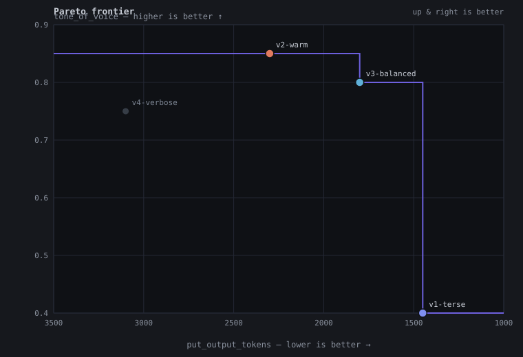

# prompt-explore

Designing agentic prompts is hard - LLMs are notoriously bad at predicting how well a prompt will work.

Being able to quickly try out a prompt is a basic requirements for optimizing a prompt.

This tool executes _any_ agentic prompt (the 'prompt under test', PUT) with _any_ tools that it needs by pairing it up with a second LLM, the simulator. The simulator's job is simple: to mock a response for every tool call.

A user of `prompt-explore` can steer the simulator's behaviour by controlling the world the simulator is operating in.

Example: if you're testing a user support agent prompt, you may want to tell the simulator that the user is a premium subscriber with a long positive shopping history, but the last three shipments were cancelled. The simulator picks that context up and mocks responses accordingly.

The tool is 100% sandboxed, no tool calls can ever reach the outside, no hard drive access to any tools. This makes it easy to run many scenarios in parallel.

## Multi-dimensional prompt optimization (grades + Pareto frontier)

Optimizing a prompt is never only about correctness — you also care about
cost, tone, self-containedness, repeatability, … . prompt-explore
supports this without ever judging for you:

- **Measured axes** are harness-computed on every run and cannot be
  graded: `put_/sim_{input,output,cache_read}_tokens`, `put_/sim_cost_usd`
  (when the model catalog prices the model), and
  `steps_per_trace_{avg,min,max,stdev}`. Their better-direction is baked
  in (tokens lower, cache-read higher, cost lower, steps lower).
- **Judged axes** are yours: PATCH numeric grades with free-form axis
  names onto an investigation. The harness stores them and never
  interprets them.
- `POST /api/frontier` computes the Pareto frontier over any mix of the
  two, with direction declared per request (`"better": "lower" |
  "higher"`) — never stored, because cost and cache-read already break
  any single global convention. `?format=json` returns the points with
  `on_frontier` / `dominated_by` (N axes allowed); `?format=svg` renders
  exactly 2 axes as a scatter with the non-dominated staircase, with
  lower-is-better axes pixel-inverted so **up-and-right is always
  better**. The web UI has a grades editor on each job card and a
  frontier panel.

Everything the frontier needs is in memory, like the jobs themselves —
the set of investigations in a campaign is yours (you created the ids).

### Example: four variants of a cancel-bot prompt

Run the whole flow against a seeded loopback server — no provider keys
needed, grading and the frontier are LLM-independent:

```
$ prompt-explore-server --demo-frontier
```

Four template variants ran as investigations; after reading the traces
you grade the soft axes (merge per axis; `null` deletes):

```
$ curl -X PATCH 'http://127.0.0.1:8099/api/investigations/v2-warm' \
    -H 'content-type: application/json' -d '{"grades": {"tone_of_voice": 0.85, "self_containedness": 0.9}}'
{
  "grades": {
    "self_containedness": 0.9,
    "tone_of_voice": 0.85
  }
}
```

Reserved axes are harness-computed, so grading one is rejected with the
fix named:

```
$ curl -X PATCH .../api/investigations/v1-terse -d '{"grades": {"put_cost_usd": 3.0}}'
{
  "error": "grades_invalid",
  "problems": [ { "axis": "put_cost_usd", "reason": "reserved_axis_name",
      "detail": "'put_cost_usd' is a reserved measured axis (better: lower); measured axes are computed by the harness and cannot be graded — pick a different name" } ]
}
```

Then the frontier, over a measured axis × a judged axis:

```
$ curl -X POST 'http://127.0.0.1:8099/api/frontier?format=json' \
    -H 'content-type: application/json' -d '{
      "investigations": ["v1-terse", "v2-warm", "v3-balanced", "v4-verbose"],
      "axes": [{"name": "put_output_tokens", "better": "lower"},
               {"name": "tone_of_voice", "better": "higher"}] }'
{
  "points": [
    { "investigation": "v1-terse",    "label": "cancel-bot",
      "values": { "put_output_tokens": 1450.0, "tone_of_voice": 0.4  }, "on_frontier": true,  "dominated_by": [] },
    { "investigation": "v2-warm",     "label": "cancel-bot#2",
      "values": { "put_output_tokens": 2300.0, "tone_of_voice": 0.85 }, "on_frontier": true,  "dominated_by": [] },
    { "investigation": "v3-balanced", "label": "cancel-bot#3",
      "values": { "put_output_tokens": 1800.0, "tone_of_voice": 0.8  }, "on_frontier": true,  "dominated_by": [] },
    { "investigation": "v4-verbose",  "label": "cancel-bot#4",
      "values": { "put_output_tokens": 3100.0, "tone_of_voice": 0.75 }, "on_frontier": false,
      "dominated_by": ["v2-warm", "v3-balanced"] } ]
}
```

The terse variant is cheapest, the warm one has the best tone, and
balanced joins them on the frontier; verbose is dominated on both axes.
The same request with `?format=svg` renders it:



And when a request can't be plotted yet, every problem comes back typed
with its fix — including the exact PATCH to make:

```
{ "investigation": "v1-terse", "axis": "self_containedness", "reason": "no_grade",
  "detail": "no caller grade named 'self_containedness' on investigation 'v1-terse'; PATCH /api/investigations/v1-terse with {\"grades\":{\"self_containedness\": <number>}} (higher = better on your scale, per this request's 'better'); graded axes on this investigation: tone_of_voice; reserved measured axes: ..." }
```

## Server architecture

The tool functions as a server with an endpoint that serves a thoroughly documented openapi spec. Simply point your coding agent at 127.0.0.1:8080/openapi.json and it will know how to use this.

## Code

This entire repo is a vibe coded server (only the README is mostly written hand-written). There was no security audit. It comes without warranty.

### Authentication (optional)

By default the server binds to `127.0.0.1:8080` (loopback-only, reachable only
from this machine) and runs with no auth. A non-loopback bind
(`PROMPT_EXPLORE_ADDR=0.0.0.0:8080`) is refused unless you set
`PROMPT_EXPLORE_ALLOW_INSECURE_PUBLIC=1`, because over plain HTTP the bearer
token and all traces travel in cleartext. If you do expose it, set
`PROMPT_EXPLORE_API_TOKEN` too: `POST /api/investigations` spends your provider
credits. When a token is set, every `/api/*` route (except the OpenAPI spec)
requires an `Authorization: Bearer <token>` header. The web UI prompts for the
token and stores it in localStorage.

## Supported APIs

 - AWS Bedrock
 - Vertex API
 - Baseten
 - OpenRouter
 - z.ai coding subscription
 - send a pr or feature request if you'd like more.

## How to try this out

### 1. Get the server binary

**Option A — download a release (recommended; no Rust toolchain needed).**
Grab the archive for your platform from the
[Releases page](https://github.com/kaeluka/prompt-explore/releases), extract
it, and run it directly:

```
tar -xzf prompt-explore-server-<your-target>.tar.gz   # .zip on windows
./prompt-explore-server --version
```

Prebuilt targets: linux x86_64/ARM64 (musl — fully static, runs on any
Linux), macOS x86_64/ARM64, windows x86_64.

**Option B — build from source** (needs a Rust toolchain):

```
$ cargo build --release
$ target/release/prompt-explore-server --version
```

Whichever path you take, `--help` prints usage and the environment variables:

```
$ prompt-explore-server --help
prompt-explore-server 0.1.2

Property-based testing for agent behavior. HTTP API + web UI.

USAGE:
    prompt-explore-server [OPTIONS]

OPTIONS:
    --dump-openapi    Print the OpenAPI spec as JSON and exit
    --demo-frontier   Run the grades + Pareto-frontier demo against a live
                      loopback server (seeded with a representative 4-variant
                      campaign; no provider keys needed — grading and the
                      frontier are LLM-independent), print the HTTP transcript,
                      and exit
    -h, --help        Print this help message and exit
    -v, --version     Print version and exit

ENVIRONMENT:
    PROMPT_EXPLORE_PROVIDER  Which provider runs the LLM calls (default: zai).
                           zai | zai_standard | openrouter | bedrock | baseten | gemini
    ZAI_API_KEY            API key for zai / zai_standard (coding-plan default).
    OPENROUTER_API_KEY     API key for openrouter.
    bedrock uses the default AWS credential chain (aws sso login, profiles, IMDS).
    gemini uses GCP Application Default Credentials (gcloud auth application-default
                           login). Project: VERTEX_PROJECT_ID or gcloud config;
                           region: VERTEX_LOCATION (default: global).
    BASETEN_API_KEY      API key for baseten (OpenAI-compatible).
    BASETEN_ENDPOINT     Baseten endpoint (default: https://inference.baseten.co/v1/).
    PROMPT_EXPLORE_ADDR    Bind address (default: 127.0.0.1:8080, loopback-only).
    PROMPT_EXPLORE_API_TOKEN  Optional bearer token. When set, every /api/* route
                           (except the OpenAPI spec) requires an
                           `Authorization: Bearer <token>` header.
                           Empty or unset = open mode (no auth).
    PROMPT_EXPLORE_ALLOW_INSECURE_PUBLIC
                           Set to 1 to allow a non-loopback bind over plain HTTP
                           (the bearer token and all traces travel in cleartext).
```

### 2. Setup with your coding agent

Tell your coding agent to
1. read the README. Place an api key for one of the supported providers in a local file and point the agent at the file (or log in using the `aws` or `gcloud` clis).
2. ask the agent to start the server and read the openapi specs.
3. ask the agent to try the tool out, while you watch the output in the web ui at http://127.0.0.1:8080

If you started the server with `PROMPT_EXPLORE_API_TOKEN` set, give the token to
your agent too (it goes in an `Authorization: Bearer <token>` header on `/api/*`
calls), and enter the same token in the web UI when prompted.
